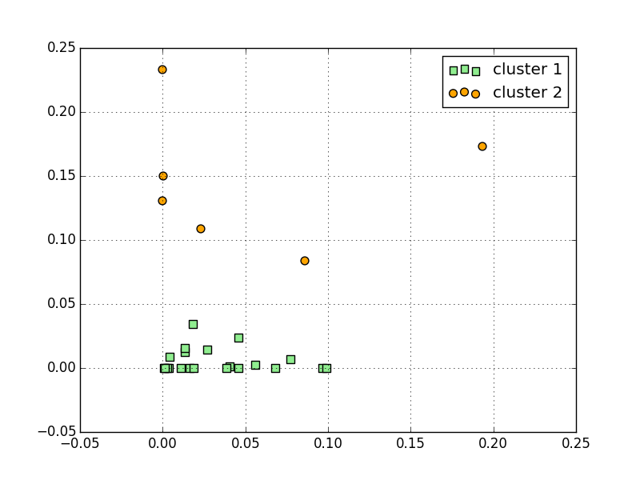
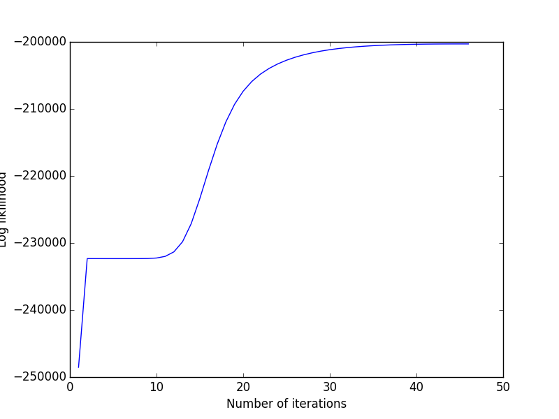

# Hidden-Markov-Model
In this repository, I am implementing hidden markov model using the paper from https://www.cs.sjsu.edu/~stamp/RUA/HMM.pdf.
This python program generated a observation sequence using the brown dataset from the nltk package in python. The task is to apply HMM using some initial estimates of A, B and prior, and improving the loglikilihood of the observation using the current parameters of the model. I have implemented forward backward algorithm to estimate the alpha and beta parameters. I have also implemented a way to update the input perimeter values. 

# Log Likilihood Plot for each iteration

# Probability of each character in each state 
| Character   | Probability of being in each state   |
|:------------|:-------------------------------------|
| a           | [ 0.06536201  0.0670236 ]            |
| b           | [ 0.00913471  0.0088676 ]            |
| c           | [ 0.02573597  0.02546636]            |
| d           | [ 0.03675014  0.03565931]            |
| e           | [ 0.10327193  0.10233617]            |
| f           | [ 0.0233564   0.02264972]            |
| g           | [ 0.01320878  0.0127948 ]            |
| h           | [ 0.03506467  0.04088491]            |
| i           | [ 0.05899218  0.06257677]            |
| j           | [ 0.00633337  0.00606892]            |
| k           | [ 0.00222697  0.00217349]            |
| l           | [ 0.03212009  0.0326751 ]            |
| m           | [ 0.02159236  0.02160751]            |
| n           | [ 0.05354537  0.05444682]            |
| o           | [ 0.05694438  0.05824435]            |
| p           | [ 0.02136761  0.02103527]            |
| q           | [ 0.00040097  0.00039905]            |
| r           | [ 0.05509748  0.05569732]            |
| s           | [ 0.04601189  0.04638487]            |
| t           | [ 0.09399244  0.07576546]            |
| u           | [ 0.02482068  0.0255728 ]            |
| v           | [ 0.00626115  0.0061399 ]            |
| w           | [ 0.01085703  0.01034739]            |
| x           | [ 0.00155239  0.00164679]            |
| y           | [ 0.01420238  0.01459423]            |
| z           | [ 0.00081861  0.00078171]            |
|             | [ 0.18097802  0.18815976]            |

# Clustering plot after k-means algorithm on the final B matrix 

# With the training set of size 5000, hmm was able to cluster a, e, i, o, t and space character together. It makes intitutive sense, except for the "t" character.

| Character   |   Cluster Assignmment |
|:------------|----------------------:|
| a           |                     1 |
| b           |                     0 |
| c           |                     0 |
| d           |                     0 |
| e           |                     1 |
| f           |                     0 |
| g           |                     0 |
| h           |                     0 |
| i           |                     1 |
| j           |                     0 |
| k           |                     0 |
| l           |                     0 |
| m           |                     0 |
| n           |                     0 |
| o           |                     1 |
| p           |                     0 |
| q           |                     0 |
| r           |                     0 |
| s           |                     0 |
| t           |                     1 |
| u           |                     0 |
| v           |                     0 |
| w           |                     0 |
| x           |                     0 |
| y           |                     0 |
| z           |                     0 |
|             |                     1 |

# Running HMM with training size of 80000 characters 
# Cluster plot showing clusters for each character

# Probability table 
| Character   | Probability of being in each state   |
|:------------|:-------------------------------------|
| a           | [  3.20560207e-06   1.40629926e-01]  |
| b           | [  2.21727202e-02   1.28896786e-09]  |
| c           | [ 0.05317007  0.00049236]            |
| d           | [  6.31235790e-02   2.21467956e-05]  |
| e           | [  5.67438227e-09   2.18188900e-01]  |
| f           | [  3.30333148e-02   1.30105542e-13]  |
| g           | [ 0.02175535  0.00573721]            |
| h           | [  7.20553731e-02   3.32645685e-08]  |
| i           | [  1.29141467e-07   1.24679232e-01]  |
| j           | [  3.80239594e-03   1.02928852e-19]  |
| k           | [ 0.00597973  0.00246249]            |
| l           | [  6.66429514e-02   4.61246490e-05]  |
| m           | [  3.92597381e-02   2.99901464e-12]  |
| n           | [  1.08653464e-01   1.84441392e-11]  |
| o           | [  1.57826854e-08   1.32168559e-01]  |
| p           | [ 0.03318497  0.00262699]            |
| q           | [  1.28330860e-03   3.11023203e-11]  |
| r           | [  9.79829905e-02   1.33195553e-13]  |
| s           | [ 0.10387844  0.00039363]            |
| t           | [ 0.12508387  0.02533221]            |
| u           | [  9.54830306e-05   4.40908832e-02]  |
| v           | [  1.54947635e-02   4.68690135e-26]  |
| w           | [  2.34085000e-02   1.29059432e-11]  |
| x           | [  3.77863097e-03   5.53726380e-18]  |
| y           | [ 0.01803454  0.00704432]            |
| z           | [  1.09318883e-03   3.58543607e-34]  |
|             | [ 0.08702928  0.29608499]            |
# Cluster Assignment table 
| Character   |   Cluster Assignmment |
|:------------|----------------------:|
| a           |                     1 |
| b           |                     0 |
| c           |                     0 |
| d           |                     0 |
| e           |                     1 |
| f           |                     0 |
| g           |                     0 |
| h           |                     0 |
| i           |                     1 |
| j           |                     0 |
| k           |                     0 |
| l           |                     0 |
| m           |                     0 |
| n           |                     0 |
| o           |                     1 |
| p           |                     0 |
| q           |                     0 |
| r           |                     0 |
| s           |                     0 |
| t           |                     0 |
| u           |                     0 |
| v           |                     0 |
| w           |                     0 |
| x           |                     0 |
| y           |                     0 |
| z           |                     0 |
|             |                     1 |
