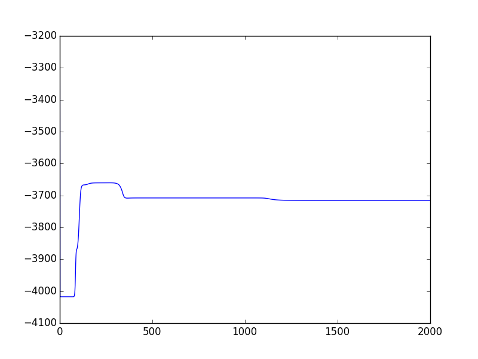

# Hidden-Markov-Model
In this repository, I am implementing hidden markov model using the paper from https://www.cs.sjsu.edu/~stamp/RUA/HMM.pdf.
This python program generated a observation sequence using the brown dataset from the nltk package in python. The task is to apply HMM using some initial estimates of A, B and prior, and improving the loglikilihood of the observation using the current parameters of the model. I have implemented forward backward algorithm to estimate the alpha and beta parameters. I have also implemented a way to update the input perimeter values. 

# Log Likilihood Plot for each iteration

# Probability of each character in each state 
| Character   | Probability of being in each state   |
|:------------|:-------------------------------------|
| a           | [ 0.06536201  0.0670236 ]            |
| b           | [ 0.00913471  0.0088676 ]            |
| c           | [ 0.02573597  0.02546636]            |
| d           | [ 0.03675014  0.03565931]            |
| e           | [ 0.10327193  0.10233617]            |
| f           | [ 0.0233564   0.02264972]            |
| g           | [ 0.01320878  0.0127948 ]            |
| h           | [ 0.03506467  0.04088491]            |
| i           | [ 0.05899218  0.06257677]            |
| j           | [ 0.00633337  0.00606892]            |
| k           | [ 0.00222697  0.00217349]            |
| l           | [ 0.03212009  0.0326751 ]            |
| m           | [ 0.02159236  0.02160751]            |
| n           | [ 0.05354537  0.05444682]            |
| o           | [ 0.05694438  0.05824435]            |
| p           | [ 0.02136761  0.02103527]            |
| q           | [ 0.00040097  0.00039905]            |
| r           | [ 0.05509748  0.05569732]            |
| s           | [ 0.04601189  0.04638487]            |
| t           | [ 0.09399244  0.07576546]            |
| u           | [ 0.02482068  0.0255728 ]            |
| v           | [ 0.00626115  0.0061399 ]            |
| w           | [ 0.01085703  0.01034739]            |
| x           | [ 0.00155239  0.00164679]            |
| y           | [ 0.01420238  0.01459423]            |
| z           | [ 0.00081861  0.00078171]            |
|             | [ 0.18097802  0.18815976]            |
